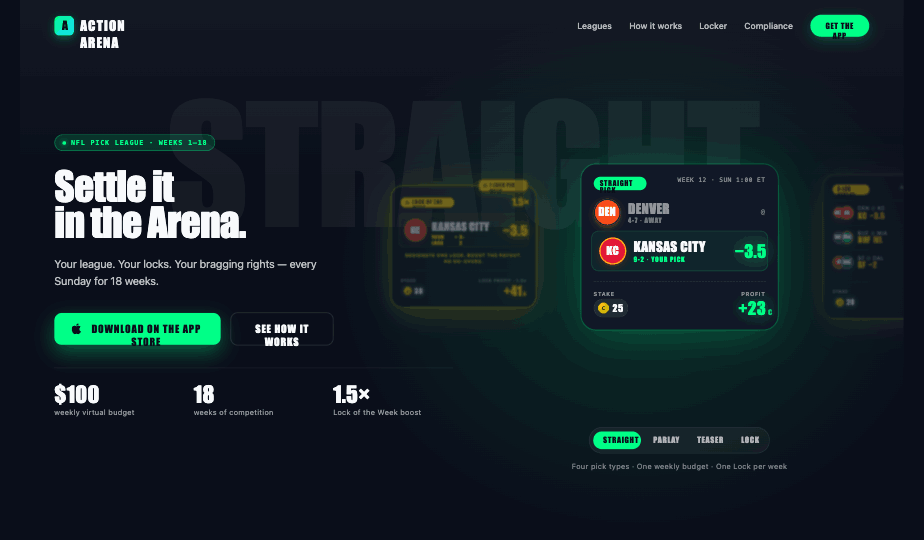
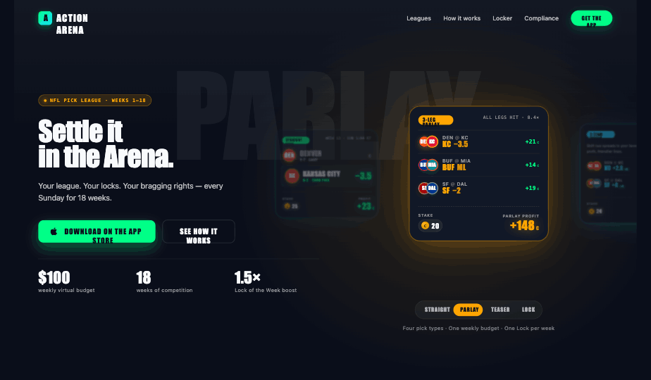
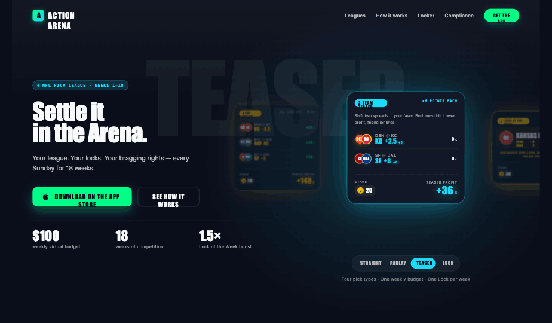
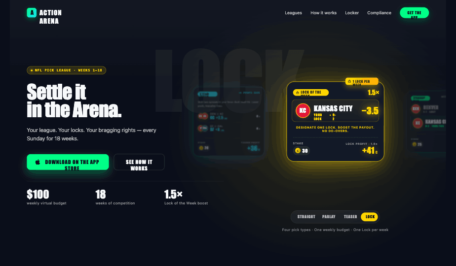
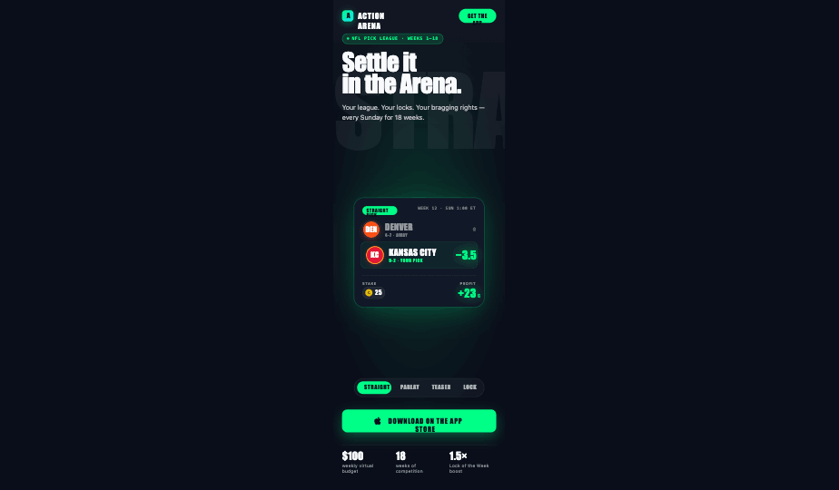
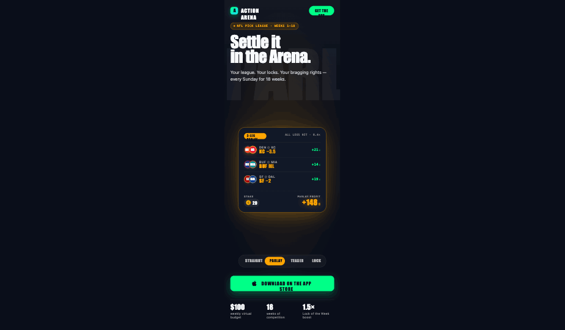
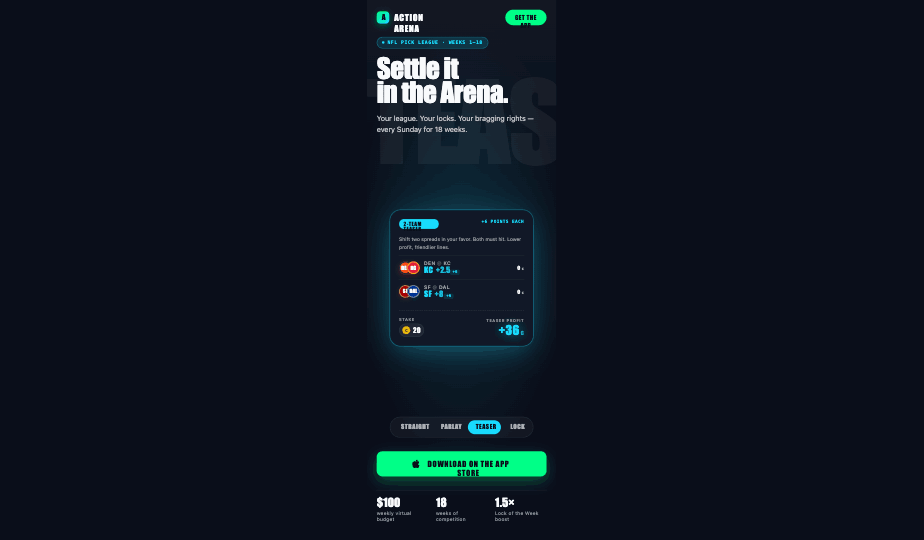
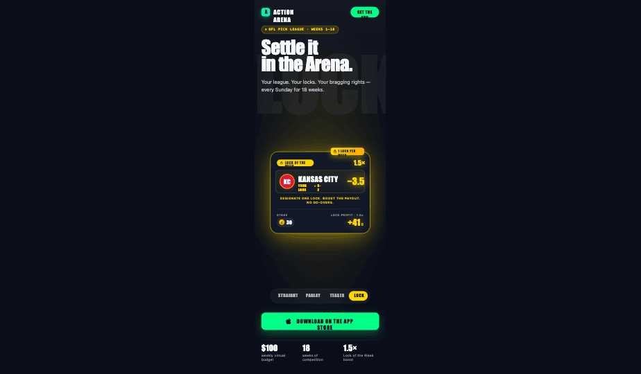

# Handoff: Action Arena — Marketing Landing Page

## Overview
This is the production specification for the **Action Arena marketing
landing page** — the canonical "what is this" surface every paid social /
App Store reviewer click lands on. Hero leads with a 4-state pick-type
carousel (STRAIGHT → PARLAY → TEASER → LOCK), backed by a 3-step
"how it works" strip and a footer.

Target stack (per project standards):
**Vite + React + TypeScript + Tailwind + Framer Motion**.

## Visual Preview

Hero captures of all 4 carousel states at both viewports (see `screenshots/`):

### Desktop — 1440 wide

| State | Preview |
|---|---|
| 01 · STRAIGHT (electric-green) |  |
| 02 · PARLAY (amber)           |  |
| 03 · TEASER (cyan)            |  |
| 04 · LOCK of the Week (gold)  |  |

### Mobile — 390 wide

| State | Preview |
|---|---|
| 01 · STRAIGHT |  |
| 02 · PARLAY   |  |
| 03 · TEASER   |  |
| 04 · LOCK     |  |

Note: all 8 captures show only the **hero fold**. For the "how it works"
strip + footer, open `Action Arena Landing.html` in a browser to see the
full page.

## About the Design Files
The files in this bundle are **design references created in HTML** —
prototypes showing intended look and behavior, not production code to
copy directly. Your task is to **recreate these HTML designs in the
target codebase's existing environment** (Vite + React + TS + Tailwind +
Framer Motion) using its established patterns from `tailwind.config.js`
and `constants/theme.ts`.

Inline CSS-in-JS in the prototype is just a delivery vehicle. Port to
Tailwind utility classes per the mapping below.

## Fidelity
**High-fidelity (hifi).** Final colors, typography choices, spacing,
component composition, interaction states, and animation timings are
locked. Recreate pixel-perfectly using the existing token system from
`tailwind.config.js` (all colors used already exist as named tokens —
no new palette entries needed).

The exception: the **Tweaks panel** in the prototype (`tweaks-panel.jsx`)
and the **DesignCanvas wrapper** (`design-canvas.jsx`) are author-time
scaffolding. **Do not port either.** Pick the locked tweak values
(see "Tweak → Production Defaults" below) and ship those statically.

---

## Screens / Views

### 01 · Hero
Top-of-page fold. The visual centerpiece.

- **Purpose:** Communicate Action Arena's pick-type system (Straight,
  Parlay, Teaser, Lock) and convert to App Store install.
- **Layout:**
  - **Desktop (≥ 768px):** 2-column CSS Grid, `grid-template-columns: 1.05fr 1fr`,
    `gap: 60px`, vertically centered. Left = headline + deck + CTAs + key
    stats. Right = carousel stage + state tabs.
  - **Mobile (< 768px):** Single column, stacked. Headline → carousel →
    state tabs → CTA → key stats.
  - Padding: desktop `pt-6 px-14 pb-14`, mobile `pt-5 px-5 pb-9`.
  - Min-height: desktop `880px`, mobile `760px`.
  - Background: `bg-arena-bg` (`#0A0E1A`) + animated radial-gradient tint
    layer keyed off active carousel state (see Animations).
- **Components on this screen:** `Nav`, `GhostText`, `CarouselStage`,
  `StateTabs`, `KeyStats`, `AppleIcon`, two CTA buttons.

### 02 · How It Works
3-step strip explaining the loop. Mid-page.

- **Purpose:** Show that the system stitches (start league → spend $100 →
  beat friends). Step 3 hosts the WinCelebration payoff per design intent
  (the celebration is the *reward*, not the proposition).
- **Layout:**
  - Background: `bg-arena-surface` (`#111827`).
  - Padding: desktop `py-24 px-14`, mobile `py-14 px-5`.
  - Inner max-width: `1280px`, centered.
  - Header block: eyebrow + H2, `max-w-[640px]`, margin-bottom 56px desktop / 32px mobile.
  - Step grid: desktop `grid-cols-3 gap-6`, mobile `grid-cols-1 gap-4`.
- **Components on this screen:** `StepCard` ×3, `LeagueVisual`, `LineupVisual`, `CelebrationVisual`.

### 03 · Footer
Compliance + legal + secondary nav.

- **Purpose:** Single-paragraph virtual-currency disclosure (App Store
  Guideline 5.3 compliance), plus standard utility links.
- **Layout:**
  - Background: `bg-arena-bg` (`#0A0E1A`).
  - Border-top `border-white/[0.06]`.
  - Padding: desktop `py-10 px-14`, mobile `py-8 px-5`.
  - Two-column flex desktop (logo + disclosure left, links right),
    stacked mobile.

---

## Components

All components in `src/landing/`. TypeScript signatures below.

### `<LandingPage>` — page root
```ts
type LandingPageProps = {
  variant?: 'desktop' | 'mobile'; // SSR hint; client also reads viewport
};
```
Composes `<Hero>` + `<HowItWorks>` + `<Footer>` in order.
Owns the global `--aa-display` CSS variable (hard-locked to Bebas Neue
stack in production — see "Tweak → Production Defaults").

### `<Hero>`
```ts
type HeroProps = { variant: 'desktop' | 'mobile' };
```
Hosts the carousel state machine. Renders bg tint layer + ghost text +
nav + body. Body component differs by variant (`<DesktopHeroBody>` /
`<MobileHeroBody>`).

### `<CarouselStage>`
```ts
type CarouselStageProps = {
  activeIdx: 0 | 1 | 2 | 3;
  onSelect: (idx: number, fromUser: boolean) => void;
  reducedMotion: boolean;
};
```
Renders all 4 cards mounted simultaneously, positioned via Framer Motion
variants (center / left / right / hidden). 540px stage height.
**Click on a non-center card** advances to that card and sets
`userInteracted = true`.

### `<StateTabs>`
```ts
type StateTabsProps = {
  active: 'straight' | 'parlay' | 'teaser' | 'lock';
  onSelect: (next: typeof active, fromUser: true) => void;
};
```
Pill group, 4 buttons. Active = filled with state accent color, text
`#0A0E1A`. Inactive = transparent, `text-white/65`.

### `<GhostText>`
```ts
type GhostTextProps = {
  word: 'STRAIGHT' | 'PARLAY' | 'TEASER' | 'LOCK';
  variant: 'desktop' | 'mobile';
};
```
Positioned absolutely behind the hero, `pointer-events: none`,
`opacity: 0.05` (white). Cross-fades on word change.

### `<Nav>`
```ts
type NavProps = { variant: 'desktop' | 'mobile' };
```
Mobile: logo + wordmark + single "GET THE APP" button.
Desktop: logo + wordmark + 4 link items (Leagues · How it works · Locker
· Compliance) + "GET THE APP" CTA.

### Pick cards (4 variants, in `src/landing/pick-cards/`)
```ts
type PickCardProps = { scale?: number; /* default 1 */ };
```
- `<StraightCard>` — 1 leg, green accent.
- `<ParlayCard>` — 3 legs, amber accent, 8.4× multiplier label.
- `<TeaserCard>` — 2 legs with +6 point boost, cyan accent.
- `<LockCard>` — 1 leg, gold accent, padlock badge, "1 LOCK PER WEEK",
  1.5× multiplier indicator, premium gold ring (2px instead of 1px).

All cards: 320px wide, fixed structure. Each composes:
- `<PickTypeBadge>` (pill with type name + optional icon)
- One or more `<LegRow>` (crests + team + line + profit/lock state)
- `<FooterRow>` (stake on left, profit on right)
- Optional top-edge `badge` slot (LockCard only)

### `<StepCard>`
```ts
type StepCardProps = {
  num: '01' | '02' | '03';
  title: string;
  body: string;
  accent: '#00FF87' | '#FFA502' | '#FFD700'; // electric-green / amber / gold
  visual: React.ReactNode;
};
```
24px padded card, `bg-arena-bg`, 1px `border-white/[0.06]` border,
`rounded-3xl`. Visual region is 200px tall, `rounded-2xl`, with a radial
gradient backdrop tinted to `accent + alpha 0x14`.

### Step visuals
- `<LeagueVisual>` — Standings mock, 260px wide. Title "SUNDAY CREW · WK 9", 4 rows of (crest, name, record, profit). "YOU" tag on row 1.
- `<LineupVisual>` — Lineup mock, 260px wide. Title "YOUR LINEUP · WK 9", budget meter (`$78 / $100`, 78% gradient bar), 4 pick rows (STRAIGHT / PARLAY / TEASER / LOCK), each with left border in the type's accent color.
- `<CelebrationVisual>` — `<svg>` celebration, 260×180. 14 radial sparkle lines + 18 small circles, centered "+148" coin text in electric-green with glow.

### `<TeamCrest>`
```ts
type TeamCrestProps = {
  code: 'KC' | 'DEN' | 'BUF' | 'MIA' | 'SF' | 'DAL' | 'PHI' | 'GB' | 'BAL' | 'DET';
  size?: number; // default 36
};
```
Circle placeholder. `background = TEAMS[code].primary`, inner 2px ring
in `TEAMS[code].secondary`, monogram letter in `font-display`, white,
sized at `size * 0.42`. Drop shadow `0 4px 12px <primary>33`.

`TEAMS` map (in `src/landing/teams.ts`) holds the per-team 2-tone palette.
Lifted from `pick-cards.jsx`.

---

## Design Tokens

All colors below already exist as named entries in
`tailwind.config.js` and `constants/theme.ts` — **do not add new
tokens**. The matching Tailwind classes are the canonical reference.

### Colors

| Hex | Tailwind | THEME_COLORS | Role on landing |
|---|---|---|---|
| `#0A0E1A` | `bg-arena-bg`, `text-arena-bg` | `bg` | Page background, Step card bg, button text on neon fills |
| `#111827` | `bg-arena-surface` | `surface` | Pick card bg, How-it-works section bg |
| `#F8FAFC` | `text-textPrimary`, `text-white` | `textPrimary` | Primary text |
| `#00FF87` | `bg-electric-green`, `text-electric-green` | `electricGreen` | Primary CTA fill, STRAIGHT accent, +profit, "YOU" tag |
| `#FFA502` | `bg-amber-accent`, `text-amber-accent` | `amberAccent` | PARLAY accent |
| `#18DCFF` | `bg-cyan-accent`, `text-cyan-accent` | `cyanAccent` | TEASER accent |
| `#FFD700` | `bg-gold`, `text-gold` | `gold` | LOCK accent, 1.5× multiplier, Lock badge |
| `#FF4757` | `text-coral-red` | `coralRed` | Negative profit in standings |

### Alpha-on-white utilities
| Class | Use |
|---|---|
| `text-white/72` | Hero deck text |
| `text-white/65` | Step card body, inactive tab text |
| `text-white/55` | Eyebrow metadata, KeyStats labels |
| `text-white/45` | Footer body |
| `text-white/40` | Secondary metadata |
| `border-white/10` | Card outlines (default) |
| `border-white/[0.08]` | Hero stat divider, navbar |
| `border-white/[0.06]` | Step card outline, Footer top border |

### Spacing
Tailwind default scale only. No `tailwind.config.js` extension required.

### Border radius
| Class | Used for |
|---|---|
| `rounded-full` | Pills, badges, status indicators |
| `rounded-3xl` (24px) | Pick card surface, Step card |
| `rounded-2xl` (16px) | Inner highlight surface, step visual region |
| `rounded-xl` (12px) | Buttons, inner pick-card highlight, lineup rows |

### Shadows (inline per surface — no token system per `TOKENS.md`)
| Surface | Shadow |
|---|---|
| Pick card (Straight, Parlay, Teaser) | `0 0 0 1px <ring>, 0 24px 60px -12px <glow>, 0 0 80px -10px <glow>` |
| Pick card (Lock) | Same, but ring is 2px instead of 1px |
| Primary CTA (desktop) | `0 12px 32px rgba(0,255,135,0.35)` |
| Primary CTA (mobile) | `0 10px 28px rgba(0,255,135,0.3)` |
| Lock-of-the-Week top badge | `0 6px 18px rgba(255,215,0,0.45), inset 0 1px 0 rgba(255,255,255,0.4)` |
| Standings / Lineup mini-cards | `0 16px 40px rgba(0,0,0,0.3)` |

---

## Typography

### Font registration (`tailwind.config.js` extend)
```js
fontFamily: {
  display: ['"Bebas Neue"', '"Anton"', '"Impact"', 'system-ui'],
  mono:    ['ui-monospace', '"SF Mono"', 'monospace'],
}
```

Body inherits the project default (system stack). Bebas Neue load:
```html
<link href="https://fonts.googleapis.com/css2?family=Bebas+Neue&display=swap" rel="stylesheet">
```
Or self-host per the production project's font strategy.

### Scale

| Use | Size | Tailwind | Weight | Tracking | Line-height |
|---|---|---|---|---|---|
| Hero H1 desktop | `clamp(64px, 7vw, 104px)` | `font-display text-[clamp(64px,7vw,104px)] font-black` | 900 | `tracking-[-0.02em]` | `leading-[0.92]` |
| Hero H1 mobile | 56px | `font-display text-[56px] font-black` | 900 | `tracking-[-0.02em]` | `leading-[0.9]` |
| Section H2 desktop | 72px | `font-display text-[72px] font-black` | 900 | `tracking-[-0.015em]` | `leading-[0.92]` |
| Section H2 mobile | 44px | `font-display text-[44px] font-black` | 900 | `tracking-[-0.015em]` | `leading-[0.92]` |
| Step card H3 | 30px | `font-display text-[30px] font-black` | 900 | `tracking-[-0.005em]` | default |
| Hero deck (desktop) | 18px | `text-lg leading-[1.55] text-white/72` | 400 | normal | 1.55 |
| Hero deck (mobile) | 15px | `text-[15px] leading-[1.5] text-white/72` | 400 | normal | 1.5 |
| Body / Step card body | 15px | `text-[15px] leading-[1.55] text-white/65` | 400 | normal | 1.55 |
| Eyebrow / metadata | 11px | `font-mono text-[11px] uppercase tracking-[0.12em] font-semibold` | 600 | 0.12em | default |
| Pick-type badge | 12px | `font-display text-xs font-black tracking-[0.08em]` | 900 | 0.08em | 1 |
| Pill / state tab | 13px | `font-display text-[13px] font-black tracking-[0.08em]` | 900 | 0.08em | 1 |
| CTA button | 17px desktop / 16px mobile | `font-display font-black tracking-[0.08em]` | 900 | 0.08em | default |
| Numeric (odds-style readout) | 10–13px | `font-mono` | 600 | `tracking-[0.02em]` | default |
| KeyStat number | 36px desktop / 24px mobile | `font-display font-black tracking-[0.01em]` | 900 | 0.01em | 1 |

Notably: `font-black` (weight 900) dominates per the project's existing
444-usage pattern. Body weight (400) is reserved for prose.

### Ghost text (special)
```
font-display font-black text-white
text-[clamp(90px,28vw,380px)]  /* desktop */
text-[clamp(60px,32vw,220px)]  /* mobile */
leading-[0.85] tracking-[-0.02em]
opacity-5  /* 0.05 */
whitespace-nowrap pointer-events-none
```
Positioned `top-[18%]` desktop / `top-[14%]` mobile, `inset-x-0 text-center`.

---

## Breakpoints and Responsive Behavior

**Single breakpoint: 768px.** No tablet-specific layout.

| Width | Treatment |
|---|---|
| `< 768px` | **Mobile.** Stacked single-column hero. Smaller carousel (`scale(0.92)`). Compact KeyStats below CTA. Section padding `py-14 px-5`. |
| `≥ 768px` | **Desktop.** 2-column grid hero. Full-size carousel. Side-by-side KeyStats. Section padding `py-24 px-14`. |

Implement with Tailwind's `md:` prefix on a single canonical class set —
don't fork into two component trees. Example:

```tsx
<section className="px-5 md:px-14 py-14 md:py-24 ...">
  <div className="grid grid-cols-1 md:grid-cols-[1.05fr_1fr] gap-6 md:gap-[60px] ...">
```

**Max content width:** `1280px` for `<HowItWorks>` inner container. Hero
fills the full viewport width with internal padding only.

**Carousel stage:** 540px tall at all viewport widths. Cards are
absolute-positioned and don't reflow — they scale via Framer Motion
transforms, not CSS.

---

## Animation Timings and Easings

### Master constants
```ts
// src/landing/animation.ts
export const TRANSITION_MS = 650;
export const EASING_CSS = 'cubic-bezier(0.4, 0, 0.2, 1)';

export const ARENA_TRANSITION = {
  duration: 0.65,
  ease: [0.4, 0, 0.2, 1] as const, // Material standard
};
```

### Carousel card variants (Framer Motion)
```tsx
const cardVariants = {
  center: { x: '0%',    scale: 1,    rotateY:   0, opacity: 1,    filter: 'blur(0px)' },
  right:  { x: '110%',  scale: 0.75, rotateY: -12, opacity: 0.4,  filter: 'blur(2px)' },
  left:   { x: '-110%', scale: 0.75, rotateY:  12, opacity: 0.4,  filter: 'blur(2px)' },
  hidden: { x: '0%',    scale: 0.6,  rotateY:   0, opacity: 0,    filter: 'blur(2px)' },
};
```
Stage container needs `perspective: 800px` and `transform-origin: center center`.

### Background tint transition
```tsx
<motion.div
  animate={{
    background: `radial-gradient(ellipse 50% 70% at 70% 50%, hsla(${meta.tint} / ${INTENSITY[bgIntensity]}), transparent 70%)`,
  }}
  transition={ARENA_TRANSITION}
/>
```

Intensity map (use `bold` for production):
```ts
const INTENSITY = { subtle: 0.06, bold: 0.14, extreme: 0.28 };
```

State HSL tints (the variable channel inside the gradient):
- `straight` → `152 100% 50%` (electric-green)
- `parlay`   → `39 100% 50%` (amber)
- `teaser`   → `189 100% 55%` (cyan)
- `lock`     → `51 100% 50%` (gold)

### Ghost text crossfade
```tsx
<AnimatePresence mode="wait">
  <motion.div
    key={active}
    initial={{ opacity: 0 }}
    animate={{ opacity: 0.05 }}
    exit={{ opacity: 0 }}
    transition={ARENA_TRANSITION}
  >{meta.ghost}</motion.div>
</AnimatePresence>
```

### State tab pill — fill color crossfade
Standard Framer Motion `animate={{ backgroundColor, color }}` with
`ARENA_TRANSITION`.

### Animation lock pattern
**Required.** Prevents rapid clicks from breaking in-flight transitions.

```ts
const isAnimating = useRef(false);

const setActive = useCallback((next: number, fromUser?: boolean) => {
  if (isAnimating.current) return;
  isAnimating.current = true;
  setTimeout(() => { isAnimating.current = false; }, TRANSITION_MS);
  if (fromUser) setUserInteracted(true);
  setActiveIdx(((next % 4) + 4) % 4);
}, []);
```

Lock duration **must equal** `TRANSITION_MS`.

### Auto-advance + first-interaction handoff
```ts
const [userInteracted, setUserInteracted] = useState(false);

useEffect(() => {
  if (userInteracted) return;
  const id = setInterval(() => {
    setActiveIdx(prev => (prev + 1) % 4);
  }, 3500);
  return () => clearInterval(id);
}, [userInteracted]);
```

Cycle interval: **3500ms** (locked production value).
`userInteracted` is set true by `<StateTabs>` clicks AND non-center card
clicks. Once true, auto-advance never re-engages for the session.

### Reduced motion
```ts
const prefersReducedMotion = useReducedMotion(); // framer-motion hook

const transition = prefersReducedMotion
  ? { duration: 0 }
  : ARENA_TRANSITION;
```
Auto-advance still cycles, but all 4 transforms cut rather than slide.

---

## Interactions & Behavior

- **Carousel auto-advance:** Cycles every 3500ms from mount until first
  user interaction.
- **State tab click:** Switches active state, sets `userInteracted = true`,
  permanently disables auto-advance for the session.
- **Non-center card click:** Same as tab click — advances to that card,
  disables auto-advance.
- **Center card click:** No-op.
- **Rapid clicks during transition:** Blocked by animation lock for 650ms.
- **"GET THE APP" CTA:** Deep-links to App Store. Eligible mobile
  visitors open the App Store; desktop visitors see the smart banner / QR.
- **"SEE HOW IT WORKS" CTA (desktop):** Smooth-scrolls to `#how-it-works`
  (Section 02).
- **Footer links:** Standard route navigation (Privacy / Terms / Press /
  Support).

---

## State Management

Scoped to the landing page. Recommend a small Zustand slice or pure
React state:

```ts
type LandingState = {
  activeIdx: 0 | 1 | 2 | 3;
  userInteracted: boolean;
};
```

No data fetching. Page is fully static.

---

## Accessibility Requirements

### Semantic structure
- Wrap each top-level section in `<section>` with an accessible name:
  ```tsx
  <section aria-labelledby="hero-h1">
    <h1 id="hero-h1">...</h1>
  ```
- `<Nav>` uses `<nav aria-label="Primary">`.
- `<Footer>` uses `<footer>`.

### Carousel
- Stage container: `role="region"` + `aria-roledescription="carousel"` +
  `aria-label="Pick types"`.
- State tabs: `role="tablist"`, each tab `role="tab"` + `aria-selected` +
  `aria-controls="pick-card-{state}"`.
- Each pick card has `role="tabpanel"` + matching `id`.
- Non-center cards: `aria-hidden="true"` + `tabIndex={-1}` so screen
  readers and keyboard users only encounter the active card.
- Keyboard:
  - `←` / `→` from any tab cycles tabs (`userInteracted = true` on first press).
  - `Home` / `End` jump to first/last.
  - `Tab` from a tab moves to the active tabpanel.

### Reduced motion
- Honor `prefers-reduced-motion: reduce` via Framer Motion's
  `useReducedMotion()`. Set `transition.duration = 0`.
- Auto-advance **still runs** (it's an information toggle, not a
  decorative animation). If your accessibility review prefers it
  disabled under reduced motion too, gate the `useEffect` on
  `!prefersReducedMotion`.

### Color contrast (verified ratios on `#0A0E1A` background)
- `#F8FAFC` text — 18.7:1 ✓ AAA
- `#00FF87` text — 12.4:1 ✓ AAA
- `#FFD700` text — 13.6:1 ✓ AAA
- `#FFA502` text — 9.1:1 ✓ AAA
- `#18DCFF` text — 11.8:1 ✓ AAA
- `text-white/55` body — 4.6:1 ✓ AA (caution: only for non-essential
  metadata; primary body text is `text-white/72`+ which is 6.6:1+)
- CTA: `#0A0E1A` text on `#00FF87` fill — 12.4:1 ✓ AAA

### Focus states
- All interactive elements get a visible focus ring. Use
  `focus-visible:ring-2 focus-visible:ring-electric-green
   focus-visible:ring-offset-2 focus-visible:ring-offset-arena-bg`.
- Pick-type tabs in particular need a visible focus indicator that's
  distinguishable from the active-tab fill.

### Decorative SVGs
- Sparkle bursts in `<CelebrationVisual>`, monogram-circle ring patterns,
  and the bg radial gradients all get `aria-hidden="true"`.

### Image alt text
No raster images in the prototype. When the production team adds
hero photography or App Store badges, every `` needs a real alt
attribute (or `alt=""` if purely decorative).

### Touch targets
All interactive elements ≥ 44×44 px tap target. State tabs are 36px tall
in the prototype — **bump to 44px** on touch viewports
(`md:h-9 h-11` or similar).

---

## Assets

No raster image assets in this design. Everything renders from SVG +
CSS:
- Team crests = colored CSS circles + text monograms (no logos —
  licensing pending per `INTAKE.md`)
- Apple App Store icon = inline SVG (`<AppleIcon>`)
- Padlock icon (Lock card + lock badge) = inline SVG
- Celebration sparkles = inline SVG (14 lines + 18 circles, randomized
  positions)
- Logo "A" mark = pure CSS gradient + text
- Arrow / chevron icons = inline SVG

**Font asset:** Bebas Neue via Google Fonts — production should
self-host per project font strategy.

**No `/public/img/...` paths required at launch.** When real NFL logos
are licensed, expect to add `public/img/teams/{code}.svg` and update
`<TeamCrest>` to render those instead of monogram circles.

---

## Tweak → Production Defaults

Lock these prototype tweak values for production:

| Tweak | Production value |
|---|---|
| `activeState` | (stateful — cycles from `straight`) |
| `autoAdvance` | `true` |
| `autoInterval` | `3500` |
| `displayFont` | `bebas` |
| `bgIntensity` | `bold` (= 0.14 alpha) |
| `ghostText` | `true` |
| `ghostScale` | `1` |
| `headline` | **TBD — pick from A / B / C; see `INTAKE.md`** |
| `reducedMotion` | (system-driven via `useReducedMotion()`) |

The 3 headline variants are exposed in the prototype's Tweaks panel.
Confirm headline choice with marketing before launch.

---

## Compliance Copy Lock-Ins

From `INTAKE.md`. Do not loosen during port — affects App Store review.

**Always use:** picks, parlay, teaser, lineup, lock, virtual coins,
profit (in coins), prediction, fantasy.

**Never use in marketing copy:** bet, betting, wager, sportsbook,
odds, payout, cash out, win money.

**No-money disclosure placement:** single footer paragraph only. Not a
hero feature. Hero leads on competition + weekly budget + bragging
rights.

---

## File Inventory

Design references in this bundle:

| File | Role |
|---|---|
| `Action Arena Landing.html` | Entry point — mounts the design canvas with desktop + mobile artboards and the Tweaks panel. |
| `landing-page.jsx` | The `<LandingPage>`, `<Hero>`, `<CarouselStage>`, `<StateTabs>`, `<GhostText>`, `<Nav>`, `<HowItWorks>`, `<StepCard>`, `<LeagueVisual>`, `<LineupVisual>`, `<CelebrationVisual>`, `<KeyStats>`, `<Footer>` components — the main source-of-truth for layout and composition. |
| `pick-cards.jsx` | The 4 `<*Card>` components, `<TeamCrest>`, `<LegRow>`, `<FooterRow>`, `<CoinChip>`, `<PickTypeBadge>`, `<CardShell>`, and the `TEAMS` palette map. |
| `design-canvas.jsx` | **Author-time scaffolding — do not port.** |
| `tweaks-panel.jsx` | **Author-time scaffolding — do not port.** |
| `HANDOFF.md` | Concise porting cheatsheet (the original Tailwind / Framer Motion handoff doc). Companion to this README. |
| `source/INTAKE.md` | Original marketing intake (audience personas, compliance, distribution plan). |
| `source/TOKENS.md` | Authoritative design token reference. |
| `source/COMPONENTS.md` | Top-marketable component list. |

---

## QA Checklist

Before merging:

- [ ] Carousel auto-advances every 3.5s on initial load.
- [ ] First click on any state tab stops auto-advance permanently for the session.
- [ ] First click on a non-center card stops auto-advance permanently.
- [ ] Rapid clicks during a 650ms transition are ignored (animation lock holds).
- [ ] Background tint, ghost text, and active card transition simultaneously over 650ms.
- [ ] All 4 cards render correctly: STRAIGHT (green), PARLAY (amber, 3 legs), TEASER (cyan, 2 legs + boost), LOCK (gold, padlock badge, 1.5×).
- [ ] LOCK card has visibly heavier presence — gold 2px ring + top "1 LOCK PER WEEK" badge + 1.5× call-out.
- [ ] Mobile breakpoint at < 768px: hero stacks, carousel fits inside 390px viewport without horizontal scroll.
- [ ] Reduced motion preference: transforms cut instead of sliding.
- [ ] Keyboard navigation works: `←`/`→` on tab list cycles tabs.
- [ ] Tab order is sane (skip the hidden non-center cards).
- [ ] No banned compliance words anywhere in copy.
- [ ] Color contrast verified at AAA for primary text.
- [ ] Lighthouse Performance ≥ 90 (Bebas Neue subset, no large hero image).
